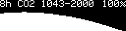

# pico_co2

Raspberry Pico CO2 measurements

This project is designed to show time, temperature, CO2 levels using a Raspberry Pi Pico microcontroller. It integrates sensors and displays to provide real-time data visualization.

## Hardware installation

### Required components

- Raspberry Pico board
- SSD1306 display
- AHT20+ENS160 sensor
- SCD4x sensor
- DS3231
- touch buttons (2x)

## Software installation

```bash
make flash
```

## Generate all possible display themes

```bash
make test-displays
```

## Display Themes

Below are examples of the different display themes available:

### Main Display


### CO2 Graph Display



## Case


## Development

### requirements for vim development

- go version go1.24.4 linux/amd64
- tinygo version 0.39.0 linux/amd64
- go install github.com/sago35/tinygo-edit@latest
- run as `tinygo-edit --target pico --editor nvim --wait`
