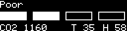
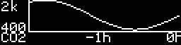
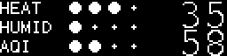

# pico_co2
Raspberry Pico CO2 measurements

This project is designed to measure CO2 levels, air quality, and other environmental parameters using a Raspberry Pi Pico microcontroller. It integrates sensors and displays to provide real-time data visualization.

## Hardware installation

### Required components

* Raspberry Pico board
* SSD1306 display
* AHT20+ENS160 sensor

### Connection


## Software installation

```bash
make flash
```

## Generate all possible display themes

```bash
make test-displays
```

## Display Themes

Below are examples of the different display themes available:

### Basic Display


### Bar Display


### Bar Display with Large Numbers


### Large Bar Display


### Numbers Only Display


### CO2 Graph Display


### Temperature and Humidity Display


### AQI Bar with Numbers Display


### Heat Index Status Display


### Sparkline Display


## Case


## Development
### requirements for vim development
* go version go1.24.4 linux/amd64
* tinygo version 0.37.0 linux/amd64
* go install github.com/sago35/tinygo-edit@latest
* run as `tinygo-edit --target pico --editor nvim --wait`
